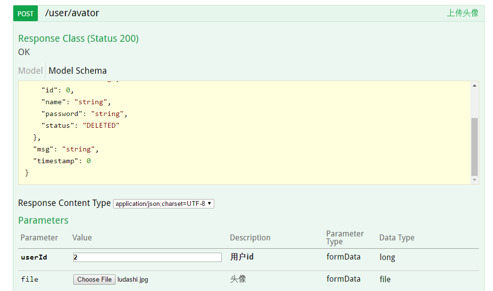

# Swagger Demo

 

 
 

 
 
 

**Branch:**

* [](http://gitlab.mljr.com/mljr/hr/commits/master) -  master
* [](http://gitlab.mljr.com/mljr/hr/commits/develop) -  develop
* [](http://gitlab.mljr.com/mljr/hr/commits/springboot) - spring-boot
* [](http://gitlab.mljr.com/mljr/hr/commits/springboot-war) -  spring-boot-war


**Author:**

 * NAME: LI JIAN
 * EMAIL: jian.li02@mljr.com

## 使用说明

具体代码请查看 demo-app-api

1. API 列表

   

2. Form 表单提交数据库，使用对象接受数据

   

3. Json 提交数据, 使用对象接受数据

   

   提交结果

   

4. 修改数据，使用 `@RequestParam`

   
   

5. 基于 Restful 规范的GET请求

   

6. 上传文件

   
   

## 其他

* `springboot` 分支是直接jar运行
* `springboot-war` 是在springboot的基础上使用外置 tomcat 容器加载服务
* springmvc 项目请参考 springboot 项目进行修改，注意swagger的扫描，如:
   spring-mvc.xml
   ```xml
   <context:annotation-config />
   <mvc:default-servlet-handler/>
   <mvc:annotation-driven />
   <beans profile="dev">
      <context:component-scan base-package="springfox.documentation"/>
   </beans>
   ```
   springmvc控制变量`spring.profiles.active` 的值是通过web.xml中配置
   ```xml
   <context-param>
       <param-name>spring.profiles.active</param-name>
       <param-value>dev</param-value>
   </context-param>
   ```

